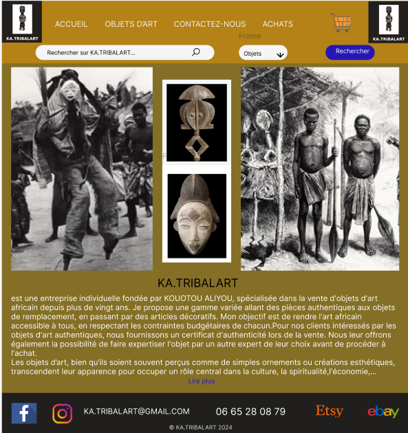
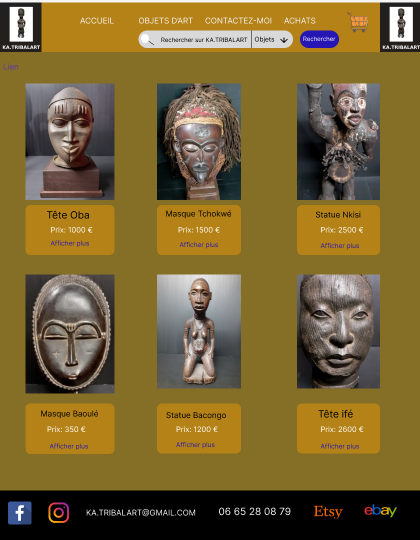
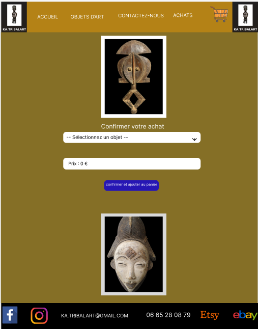
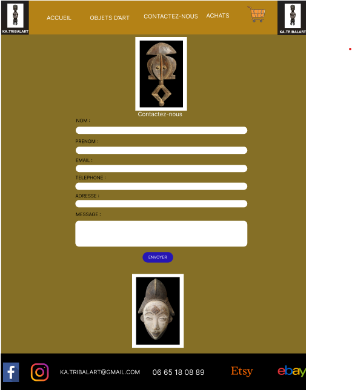

# 🎨 KA.TRIBALART - Site vitrine de vente d'objets d'art africain

## 📌 Présentation

KA.TRIBALART est un site vitrine développé en **HTML5, CSS3 et JavaScript** dans le cadre de ma formation de **Développeur Web et Web Mobile**.

Ce projet met en valeur une sélection d'objets d'art africain en proposant une navigation intuitive, des fiches produits détaillées ainsi qu'un moteur de recherche permettant de retrouver facilement les œuvres.

L'objectif était de concevoir un site statique moderne, responsive et ergonomique mettant en avant le patrimoine artistique africain.

---

# 🎯 Objectifs

Le projet permet de :

- présenter l'entreprise KA.TRIBALART ;
- valoriser les objets d'art africain ;
- consulter les fiches détaillées des œuvres ;
- effectuer une recherche parmi les objets proposés ;
- filtrer les objets par nom ;
- accéder aux plateformes de vente en ligne.

---

# 🚀 Fonctionnalités

### Navigation

- Menu de navigation
- Barre de recherche
- Filtre par nom
- Navigation entre les différentes pages

### Présentation des objets

- Catalogue des objets
- Fiches détaillées
- Description
- Prix

### Contact

- Page de contact
- Informations de l'entreprise

### Vente en ligne

Liens vers les plateformes :

- Etsy
- eBay

---

## 🛠️ Technologies utilisées

### Langages

- HTML5
- CSS3
- JavaScript

### Outils

- Visual Studio Code
- Git
- GitHub
- Figma

---

# 🏗️ Conception

Avant le développement, le projet a été conçu à l'aide de :

- Cahier des charges
- Maquettes graphiques

---

# 📷 Captures d'écran

## 🏠 Page d'accueil



---

## 🎭 Catalogue des objets



---

## 🛒 Formulaire d'achat



---

## 📞 Formulaire de contact



---

## 📁 Structure du projet

```text
CRÉATION_SITE_KA_TRIBALART/
├── images/              
├── Maquettes/                 
│
├── index.html
├── objets.html
├── achats.html
├── contact.html
├── presentation.html
│
├── style.css
├── objets.css
├── achats.css
├── contact.css
│
├── script.js
├── achats.js
├── contact.js
│
├── masque-baoule.html
├── masque-tchokwe.html
├── tete-oba.html
├── tete-ife.html
├── statue-bacongo.html
├── statue-nkisi.html
│
└── README.md
```

# 💻 Installation

```bash
git clone https://github.com/ALIYOU65/Création_site_Ka_Tribalart.git

cd Création_site_Ka_Tribalart 
```
Ouvrez ensuite le projet dans **Visual Studio Code**, puis lancez le site avec l'extension **Live Server** en cliquant sur **Go Live**.

Le site sera accessible à une adresse du type :

```text
http://127.0.0.1:5500/index.html
```
---

# 📈 Améliorations prévues

- Responsive amélioré
- Optimisation SEO
- Galerie d'images
- Mise en place de l'envoi des messages du formulaire de contact
- Mise en place d'un panier d'achat fonctionnel
- Gestion dynamique des produits avec une base de données
- Espace administrateur

---

# 👨‍💻 Auteur

**KOUOTOU ALIYOU**

Développeur Web et Web Mobile

📧 ali3bakar@gmail.com

🔗 GitHub :
https://github.com/ALIYOU65